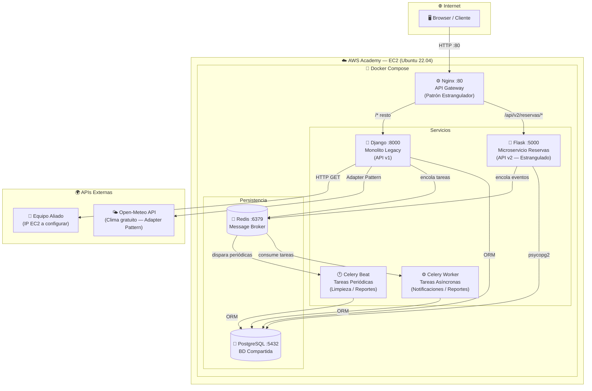
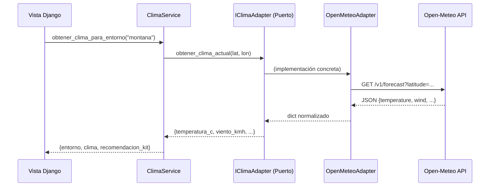
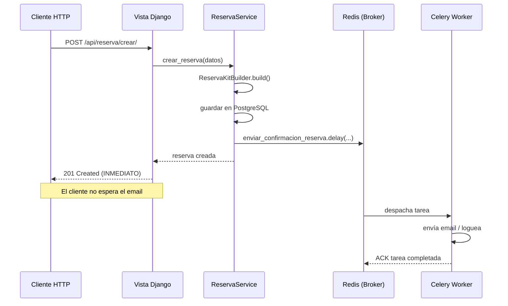

# Arquitectura JESurvivor — Entregable 2

## Diagrama General (AWS + Microservicios + Broker)

## Tabla de Rutas — API Gateway (Nginx)

| Ruta | Destino | Descripción |
|------|---------|-------------|
| `/api/v2/reservas/*` | Flask :5000 | Microservicio estrangulado |
| `/api/sistema/info/` | Django :8000 | Info expuesta al aliado |
| `/api/clima/` | Django :8000 | Adapter → Open-Meteo |
| `/api/aliado/` | Django :8000 | Consumo del equipo aliado |
| `/api/tareas/reporte/` | Django :8000 | Disparador Celery |
| `/api/docs/` | Django :8000 | Swagger UI |
| `/*` | Django :8000 | Frontend SPA |

## Patrón Adapter — Flujo

## Flujo Asíncrono — Celery + Redis

## Componentes del Entregable 2

| Componente | Archivo | Patrón / Tecnología |
|-----------|---------|---------------------|
| Message Broker | `docker-compose.yml` → redis | Redis |
| Worker asíncrono | `blog/tasks.py` | Celery |
| Tareas periódicas | Celery Beat + django-celery-beat | Cron en BD |
| Adapter clima | `blog/Application/adapters.py` | Adapter + DIP |
| API propia expuesta | `GET /api/sistema/info/` | REST JSON |
| Consumo aliado | `GET /api/aliado/` | HTTP + fallback |
| i18n | `blog/locale/es,en` | gettext |
| API Gateway | `nginx/nginx.conf` | Reverse proxy |
| Infra | `docker-compose.yml` | Docker Compose en EC2 |
